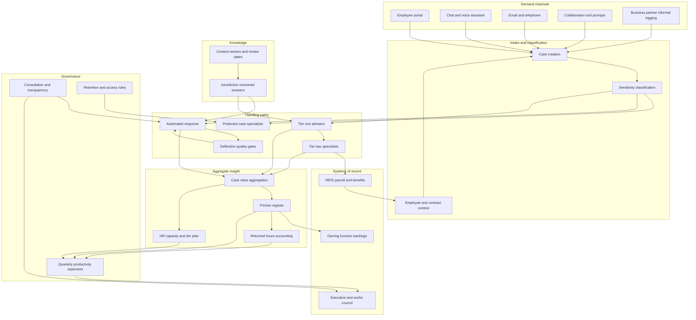

# Deskward

**Source:** `ai-in-hr/Deloitte_HR-Essential-role/`
**Domain:** `ai-hr`
**One-liner:** An HR service-delivery control tower that routes every employee request through tiered case handling, converts the recurring cases nobody reads into a costed register of organisational friction with named owners, and re-plans HR capacity from transactional work toward advisory work on the evidence.
**Wedge:** Multi-country HR shared services for 5,000–50,000 employees mid-transformation, instrumented on the twenty highest-volume case categories — pay queries, leave and absence, contract and letter requests, benefits, manager how-do-I questions — across three languages and at least two employment jurisdictions.
**Positioning:** The HR productivity ledger. Every ticketing tool in this market optimises deflection and service level; both are cost metrics for HR itself. Deskward treats the case stream as the highest-fidelity signal the enterprise has about where work is broken, because the people raising cases are the people closest to the problem — and it makes HR accountable for the employee hours it returns rather than for the tickets it closes.

## Market research synthesis

### Thesis from source

The source argues that HR's job description has changed and names the new one explicitly: "HR's New Role: The Chief Productivity Officer." It builds to that claim through a labour-market and workforce-condition argument backed by specific figures. Demand-side pressure: 77% of CEOs expect the role of AI, robotics and automation to increase significantly over the next two years; attracting, retaining and developing talent is the number one issue on which CEOs, CFOs and CHROs agree in the Conference Board's 2018 C-Suite Challenge survey of 570 executives; unemployment is near record lows with mean time to hire at 31 days, higher than it was in 2001; 41% of the workforce participates in the crowd or gig economy and essentially all new jobs created since 2008 fall into the category of alternative work; and the Bureau of Labor Statistics estimate that 65% of children entering primary school today will hold jobs that do not yet exist.

The condition of the workforce is where the source is most quantitatively useful, and it reads as an indictment of work design rather than of employees. The average US worker now spends 25% of their day reading or answering email; the average mobile phone user checks their device 150 times a day; more than 80% of companies rate their business "highly complex" or "complex" for employees; 40% of the US population believes it is impossible to succeed at work and have a balanced family life; the average US worker works 47 hours a week with 49% working 50 or more and 20% at 60-plus; since 2000 workers have lost an entire week of vacation, from 20.3 days to 16.8, and 39% want to be seen as a "work martyr" despite being less likely to be promoted; workplace stress costs roughly $300 billion a year in the US and £42 billion in the UK. And then the decisive number: fewer than 16% of companies have a program to simplify work or help employees deal with stress. Engagement sits at a Glassdoor average of 3.2. On what actually drives employment brand, the source's correlation data puts culture and values at 0.30 and senior leadership at 0.28 against compensation and benefits at 0.12 — culture and leadership roughly three times more important than salary, and career development and learning almost twice as important.

The source's structural answer is an operating model. It proposes a network of teams over hierarchy, leaders as coaches, a redesigned employee experience, open careers, and — in its HR technology architecture of the future — an explicit service-delivery stack: self-service, case management, AI and voice channels, and intelligent services sitting over HRMS, payroll and talent systems, serving distinct audiences it labels People@Work, Teams@Work, Leaders@Work, Candidates@Life and Alumni@Life. Its HR organisation chart is equally concrete: junior and senior geographic business partners, talent specialists organised in networks of excellence, HR operations with AI and bots, analytics and workforce planning, and a rewards function. Its instruction to the function is "Act as One: redefine your identity, develop HR teams, standardize, and empower local HR staff." It also cites Korn Ferry findings that 67% of CEOs believe technology will create more value than human capital and 44% of leaders in large global businesses believe robotics, automation and AI will make people "largely irrelevant" — the political context in which HR must make its own case.

The single most product-defining item in the deck is the oldest: a 1979 study of workers in eight Japanese factories by Sidney Yoshida, which found that problems known to front-line workers represented 100% of problems, those known to supervisors 74%, to middle managers 9%, and to top managers just 4%. Read alongside the finding that fewer than 16% of companies have any programme to simplify work, this identifies both a signal and a vacuum. Employees raise their friction into HR every day, in the form of cases, and HR throws that signal away as ticket volume. The reskilling evidence in the same deck sharpens the commercial case: 96% of transitions have "good-fit" options, 65% of transitions increase wages by an average of $19,000, requiring on average 1.7 additional years of experience and 1.0 years of education — which the source summarises as proof that reskilling is often much less expensive than hiring for skills, a conclusion HR can only act on if it has capacity freed from transactional work. Deskward therefore builds three things onto a case stream: tiered handling with genuinely sensitive cases protected from automation, a friction register that turns recurring case classes into owned and costed simplification initiatives, and a capacity plan that moves HR practitioners from tier-one work to advisory work with the numbers to justify it.

### Buyer & economic model

- **Primary buyer:** the HR Operations Director or Head of HR Shared Services, sponsored by the CHRO, with the CFO co-signing because HR cost per employee and returned employee hours are the two numbers that carry the business case.
- **Users:** employees and managers raising requests, tier-one service advisers, tier-two specialists in payroll, benefits, mobility and employee relations, HR business partners, knowledge and content owners maintaining jurisdiction-specific answers, work-simplification initiative owners outside HR in IT, finance and operations, employment counsel and data protection officers, and works council or employee representatives where bots and monitoring are consultable subjects.
- **Budget owner / value metric:** the HR operations budget, with work-simplification initiatives funded from the owning function. The value metric is HR cost per employee served, plus employee hours returned per quarter through resolved friction; the operating-model metric is the share of HR capacity in advisory rather than transactional tiers.
- **Competing status quo:** an enterprise service-management tool configured for HR with SLA dashboards, an intranet knowledge base employees do not trust, HR business partners quietly absorbing transactional work because escalation is faster than the queue, an annual engagement survey read once, a separate wellbeing vendor with its own portal, and a shared-services scorecard that measures cost and closure time and nothing about whether the underlying problem still exists.

### Domain constraints

- **Regulatory / trust / safety:** case content is among the most sensitive employee data there is. Grievances, whistleblowing reports, disability and accommodation requests, health and occupational health matters, harassment complaints and investigation material carry statutory protections and, in several jurisdictions, confidentiality or legal-privilege handling; none of it may be routed to an automated responder or made visible to a line manager by default. Answers about statutory leave, notice, working time and pay carry direct legal consequence, so content must be jurisdiction-versioned and attributable. Introducing bots, monitoring or automated routing into HR services is a consultable subject with works councils in much of Europe. Accommodation requests must have an accessible, human route and must not be deflected on efficiency grounds. Contingent workers using the same service desk raise co-employment exposure, because the degree of HR control exercised over them is evidence of employment status.
- **Data sensitivity:** the product holds free-text describing personal circumstances. Sensitivity classification must be applied at intake and drive routing, retention, visibility and analytics eligibility, and the friction register must operate on aggregated case classes rather than on case content, so that organisational insight never becomes a second channel into someone's grievance. Retention differs sharply by case type — a payslip query and an investigation file cannot share a schedule.
- **Change-management realities:** deflection targets and employee experience pull against each other, and a function rewarded purely on deflection will make the service worse; the metric set has to include returned employee hours to stay honest. HR business partners will keep taking side-channel requests unless the queue is visibly faster. The friction register only works if initiative owners sit outside HR — most of the friction employees report is not HR's to fix — which makes executive sponsorship a precondition rather than a nice-to-have. And with 44% of leaders in the source's own citation believing people will become "largely irrelevant," HR's credibility depends on producing numbers rather than narratives.

## Business requirements

- BR-1: Every employee and manager request must enter one case record regardless of channel, including requests that arrive informally to HR business partners, so that the true demand on the function is visible rather than the portion that happened to use the portal.
- BR-2: Cases must be classified for sensitivity at intake, and cases in protected classes — grievance, whistleblowing, harassment, health and accommodation, investigation — must be excluded from automated response, excluded from manager visibility by default, and routed only to authorised specialists.
- BR-3: Answers that carry legal consequence must be served from jurisdiction-versioned content with a named owner and a review date, and an out-of-date answer for a jurisdiction must be withheld rather than served with a disclaimer.
- BR-4: Recurring case classes must be aggregated into a friction register with an estimated employee-hour cost, a named owner accountable for the underlying cause, and a decision of fix, absorb or accept — because the case stream is the enterprise's best evidence of where work is broken.
- BR-5: The function must report employee hours returned through resolved friction alongside HR cost per employee, so that service performance is measured by the time it gives back and not only by the cost it removes.
- BR-6: HR capacity must be planned across tiers with a stated target share in advisory rather than transactional work, and movement toward that target must be evidenced from actual case handling rather than from a target operating model diagram.
- BR-7: Deflection may not be pursued where it degrades outcomes: any case category whose reopen rate, escalation rate or satisfaction breaches its threshold must have automated handling withdrawn until the content or the underlying process is fixed.
- BR-8: Accommodation and accessibility requests must always have a human route with a defined response standard, and must never be closed by an automated responder.
- BR-9: Where bots, automated routing or case analytics are introduced, the applicable consultation and transparency obligations must be raised and discharged per jurisdiction before go-live, with the record retained.
- BR-10: Contingent and third-party workers served by the desk must be identifiable as such, with the scope of service they receive recorded, so that co-employment exposure is a managed and evidenced position.
- BR-11: Retention and access must be enforced per sensitivity class and jurisdiction, with investigation and grievance material segregated from general case data and excluded from aggregate analytics.
- BR-12: The function must publish a quarterly productivity statement — demand, resolution, returned hours, friction closed, capacity shift — to the executive, so that HR's claim to a productivity mandate is asserted in numbers on a schedule.

## User stories

Canonical user stories live in sibling [USER_STORIES.md](USER_STORIES.md).

## System design

### Overview

Deskward captures demand from every channel — portal, chat and voice assistant, email, telephone, embedded prompts in collaboration tools, and a lightweight intake that HR business partners use to log requests that reached them informally — and writes each into a single case with a category, jurisdiction, contract context and sensitivity class. Sensitivity drives everything downstream: protected classes bypass automated handling entirely and route to authorised specialists with restricted visibility, while general categories may be answered from jurisdiction-versioned knowledge with deflection measured against reopen, escalation and satisfaction thresholds. Resolved and deflected cases feed two engines. The first is the friction register: recurring case classes are aggregated, costed in employee hours, and assigned to an owner — often outside HR — who decides to fix, absorb or accept, with post-fix case volume measured to verify the outcome. The second is the capacity planner, which compares demand and handling effort by tier against the target advisory share and produces the staffing and skill implications. A governance layer holds content ownership and review dates, consultation records, retention schedules and the quarterly productivity statement.

### Actors & boundaries

- **Actors:** employee, line manager, tier-one service adviser, tier-two specialist, employee relations and investigations specialist, HR business partner, knowledge and content owner, work-simplification initiative owner outside HR, HR operations director, data protection officer, employment counsel, employee representative, contingent worker, and the automated responder as a constrained actor.
- **Trust boundary:** protected-class cases are held in a segregated store with named-access control, excluded from the automated responder, excluded from manager views, and excluded from the aggregate analytics that feed the friction register. General case content is available to advisers and, in aggregate only, to the friction register. Managers see their team's non-protected cases. Initiative owners outside HR receive aggregated case classes and hour estimates, never case content. Contingent-worker cases are tagged so that service scope stays inside the boundary the classification assessment defined.
- **Human-in-the-loop points:** sensitivity reclassification; specialist handling of every protected case; content approval and withdrawal; deflection withdrawal decision when thresholds breach; friction register triage and owner assignment; consultation discharge before bot or routing go-live; accommodation case response.

### Core capabilities

1. **Omni-channel intake and case creation** — portal, assistant, email, telephone, embedded collaboration prompts, and business-partner logging of informal demand.
2. **Sensitivity classification and protected routing** — intake classification driving routing, visibility, retention and analytics eligibility.
3. **Tiered case management** — assignment, service standards, escalation paths, reopen tracking, and specialist queues.
4. **Jurisdiction-versioned knowledge** — answer content with jurisdiction, contract-type applicability, owner and review date, with withholding of stale content.
5. **Automated response with quality gates** — assistant-served answers for eligible categories, with automatic withdrawal on reopen, escalation or satisfaction threshold breach.
6. **Friction register** — aggregation of recurring case classes into costed items with owners, decisions, and post-fix verification.
7. **Returned-hours accounting** — estimation and confirmation of employee hours returned by resolved friction, reported alongside HR cost per employee.
8. **HR capacity and operating model planning** — tier-level demand and effort against the advisory-share target, with staffing and skill implications and span-of-control views.
9. **Governance and consultation** — consultation obligations, transparency notices, retention schedules, contingent-worker scope records.
10. **Productivity statement and reporting** — scheduled executive statement of demand, resolution, returned hours, friction closed and capacity shift.

### Conceptual data

- **Primary entities:** ServiceCase, CaseCategory, SensitivityClass, Channel, EmployeeContext, ContingentWorkerFlag, KnowledgeArticle, JurisdictionRule, AutomatedResponseEvent, DeflectionOutcome, EscalationTier, ServiceStandard, ReopenEvent, FrictionSignal, FrictionItem, SimplificationInitiative, ReturnedHoursRecord, HRPractitioner, HRCapacityPlan, TierCapacity, ConsultationRecord, TransparencyNotice, RetentionSchedule, ProductivityStatement.
- **Critical events:** case created from any channel; sensitivity classified or reclassified; case assigned, escalated, resolved, reopened; automated response served, accepted or rejected; deflection threshold breached and automation withdrawn; content approved, flagged or withdrawn; friction item raised, assigned, decided, fixed and verified; returned hours estimated and confirmed; capacity plan published; consultation raised and discharged; productivity statement issued.
- **Retention / audit needs:** retention per sensitivity class and jurisdiction, with grievance, whistleblowing and investigation material on its own schedule and segregated from general case data. Consultation records, transparency notices and contingent-worker scope records retained for the employment-claim limitation period. Knowledge article versions retained for the life of any advice given from them, since a dispute about statutory entitlement turns on what the employee was told and when. Aggregated friction and returned-hours records retained long enough to preserve trend comparability.

### Integrations (conceptual)

- **Systems of record:** the HRIS for population, contract, jurisdiction and manager hierarchy; payroll and benefits administration; the learning system; the leave and absence system; the contingent workforce or vendor management system; the enterprise identity directory.
- **Upstream signals:** collaboration and messaging platforms where employees ask questions, the telephony platform, the employee portal and assistant, occupational health and employee assistance referral channels operating under their own confidentiality, engagement and pulse survey instruments as corroboration for friction items, and IT service management where an HR case turns out to be a systems problem.
- **Downstream actions:** transactional execution in payroll, benefits and leave systems; letter and document generation; initiative creation in the owning function's backlog tool; capacity and requisition requests for HR roles; consultation packages to employee representatives; the executive productivity statement; and withdrawal instructions to the automated responder when a quality gate trips.

### High-level architecture

Sensitivity classification is the first gate and the most important one. Everything to the right of it is either a constrained automated path or a human path, and the analytics that generate organisational insight are fed only from the aggregate layer.

### Success metrics

- **Leading:** share of total demand captured in one case record including informally logged requests; sensitivity misclassification rate found on review; share of served answers backed by in-date jurisdiction-versioned content; first-contact resolution by category; reopen and escalation rates against thresholds; friction items raised, assigned to an owner outside HR, and decided within a cycle; consultation obligations discharged before automation go-live.
- **Lagging:** HR cost per employee served; employee hours returned per quarter through verified friction fixes, read against the source's finding that fewer than 16% of companies have any work-simplification programme; share of HR capacity in advisory rather than transactional tiers; movement in the share of the working day employees spend on administrative back-and-forth, against the source's 25%-of-day email baseline; employee and manager satisfaction with the service, and satisfaction among protected-case users specifically; reduction in regretted attrition and grievance escalation attributable to closed friction; culture and career-development scores in employment-brand measurement, which the source's correlation data ranks well above compensation.

## OpenAPI skeleton

Canonical HTTP surface lives in sibling [openapi.yaml](openapi.yaml). Summary:

- **Base path:** `/v1/...`
- **Auth:** `X-API-Key` for HRIS, payroll, telephony, collaboration and service-management integration; Bearer JWT for employee, manager, adviser, specialist, initiative-owner and governance sessions with sensitivity-scoped claims.
- **Resource groups:** Intake, Cases, Knowledge, Automation Quality, Friction Register, Returned Hours, HR Capacity, Governance, Reporting.
