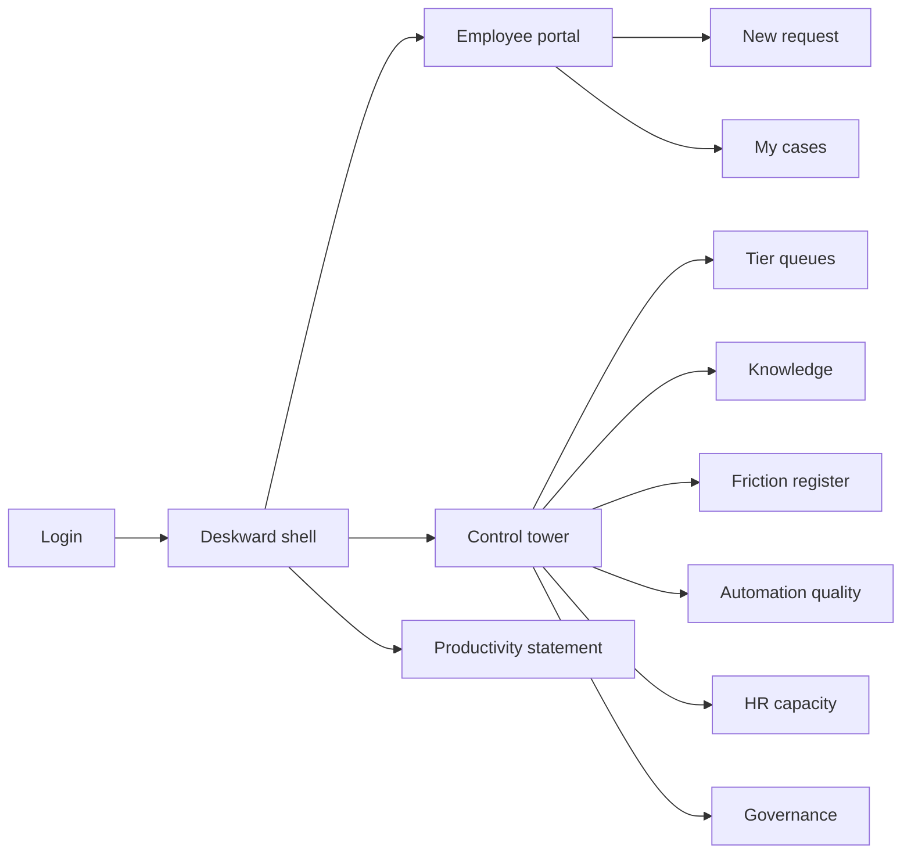
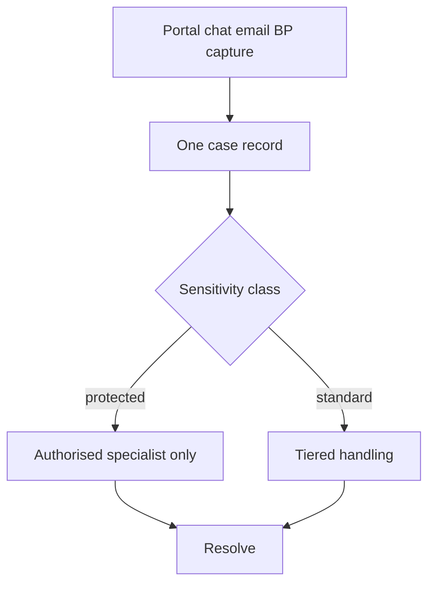
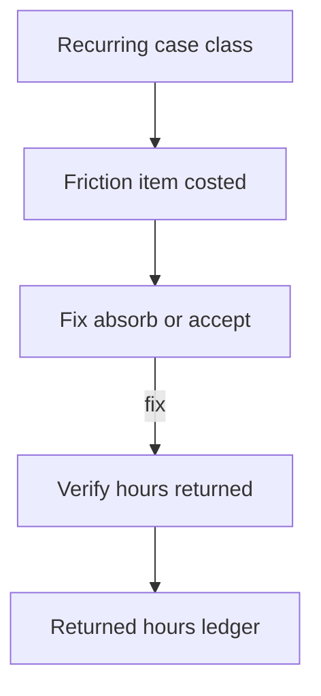

# Deskward — Web app

**Product:** [PRODUCT.md](./PRODUCT.md)
**Primary surface:** HR service-delivery control tower (shared-services + specialist workspace)
**Secondary surfaces:** Employee/manager request portal; executive quarterly productivity statement (read-only)
**Design thesis:** Deskward is a friction ledger with a service desk attached — not a deflection scoreboard. The UI metaphor is a control tower over a living case stream: every request becomes one case regardless of channel; protected classes vanish from automation and manager sightlines; recurring classes crystallise into costed friction items with named owners outside HR. Visual language is cool steel-blue on deep ink with signal cyan for returned employee hours — closed tickets feel secondary; hours given back feel primary. The brand wordmark sits as a quiet cyan mark on every friction decision and productivity statement so the CHRO’s productivity claim is stamped on numbers, not narrative.

## UX research synthesis

### Category peers (best-in-class)

- **ServiceNow HR Service Delivery:** Unified case intake, COE routing, Employee Center. Steal: one case record across channels; reject SLA/deflection as the only success metric.
- **Workday Help / Peakon + case hybrids:** Employee-facing Q&A with HRIS context. Steal: manager vs employee audiences; reject serving stale policy with a disclaimer.
- **Zendeka / Freshservice ESM for HR:** Tiered queues and knowledge. Steal: tier visibility and reopen handling; reject treating reopen as noise rather than automation-quality signal.
- **Lattice / Culture Amp (listening):** Aggregate themes without exposing individual sensitive content. Steal: friction as aggregated classes; reject drilling into grievance text from analytics.

### Patterns to adopt / reject

- **Adopt:** Omni-channel single case; sensitivity class at intake; jurisdiction-versioned knowledge with withhold-when-stale; friction register with fix/absorb/accept; returned hours as peer KPI to cost/employee; advisory vs transactional capacity plan; auto-handling withdrawal on quality breach; always-human accommodation route.
- **Reject:** Deflection-first home; manager visibility into protected cases; chatbot closing accommodations; purple AI HR assistant theatre; engagement-survey vanity as the productivity story.

### Trust, density, and workflow constraints from PRODUCT.md

Protected case classes never auto-respond or show to managers by default (BR-2). Legal answers need jurisdiction versioning and named owners; stale content withheld (BR-3). Friction register costs employee hours with external owners (BR-4–5). Capacity shift must be evidenced from actual handling (BR-6). Deflection withdraws on reopen/escalation/CSAT breach (BR-7). Accommodation always human (BR-8). Consultation before bots go live (BR-9). Contingent scope recorded (BR-10). Investigation material segregated from analytics (BR-11). Quarterly productivity statement (BR-12).

## Information architecture

### Nav model

### Roles → default home

| Role | Default home | Why |
|------|--------------|-----|
| Employee / manager | Employee portal | Raise and track requests (BR-1) |
| Tier-one adviser | Tier queues | Volume handling with sensitivity gates |
| Tier-two specialist (ER/payroll) | Protected queues | Authorised-only routing (BR-2) |
| HR Ops / shared services lead | Control tower home | Returned hours + friction (BR-5) |
| Knowledge owner | Knowledge with jurisdiction versions | Withhold stale answers (BR-3) |
| Friction initiative owner (non-HR) | Friction register | Fix/absorb/accept (BR-4) |
| CHRO / CFO | Quarterly productivity statement | Numbers on a schedule (BR-12) |

### Cross-links to OpenAPI resources

| Nav area | OpenAPI tags / resources |
|----------|---------------------------|
| Cases, sensitivity, assignment, resolution, reopen | Intake, Cases |
| Knowledge articles, withhold | Knowledge |
| Automated responses, category quality gates | AutomationQuality |
| Friction items, decisions, verification | FrictionRegister |
| Returned hours | ReturnedHours |
| Capacity plans | HRCapacity |
| Consultation records, contingent scopes | Governance |
| Service performance, productivity statement | Reporting |

## Screen inventory

### Control tower home

- **Purpose:** Show true demand, returned hours, open friction cost, and advisory capacity share — not deflection %.
- **Entry:** HR Ops login default.
- **Layout regions:** Brand + country scope; returned-hours strip; demand by channel including BP side-channel captures; friction cost open; capacity mix; quality-gate alerts.
- **Primary actions:** Open friction; withdraw automation on breached category; open productivity draft.
- **Empty / loading / error:** Empty = instrument first categories; loading = skeleton strips.
- **BR / story ties:** BR-1, BR-5, BR-6.

### Employee / manager portal

- **Purpose:** One place to raise requests across languages; surface jurisdiction-correct answers; never auto-close accommodations.
- **Entry:** Employee login; deep link from intranet.
- **Layout regions:** Brand; request composer; knowledge suggest (versioned); my cases; contingent badge if applicable; always-visible “talk to a person” for accommodation.
- **Primary actions:** Submit case; reopen; escalate to human.
- **Empty / loading / error:** Stale knowledge withheld with human CTA, not disclaimer serve.
- **BR / story ties:** BR-1, BR-3, BR-8.
- **Mobile notes:** Request submit and case status must work on phone.

### Sensitivity intake and routing

- **Purpose:** Classify sensitivity at intake; lock protected classes from bots and managers.
- **Entry:** New case create (all channels including BP capture form).
- **Layout regions:** Sensitivity classifier with override; routing preview; visibility matrix; segregation banner for investigation/grievance.
- **Primary actions:** Confirm class; assign specialist queue; block auto-response.
- **Empty / loading / error:** Unclassified = cannot route to automation.
- **BR / story ties:** BR-2, BR-11.

### Tier queues and case workspace

- **Purpose:** Handle cases by tier with reopen, escalation, and resolution — BP side-channel cases appear here too.
- **Entry:** Adviser/specialist default.
- **Layout regions:** Queue filters (non-protected vs protected spaces); case timeline; knowledge pane; contingent scope chip; resolution controls.
- **Primary actions:** Resolve; reopen; escalate; capture informal BP request as case.
- **Empty / loading / error:** Empty queue = healthy; wrong-sensitivity access = hard deny.
- **BR / story ties:** BR-1, BR-2, BR-10.

### Knowledge library

- **Purpose:** Jurisdiction-versioned answers with owner and review date; withhold when out of date.
- **Entry:** Knowledge nav; case suggest.
- **Layout regions:** Article list by jurisdiction; version history; review clock; withhold control.
- **Primary actions:** Publish; withhold; schedule review.
- **Empty / loading / error:** Expired review = auto-withhold, never soft-serve.
- **BR / story ties:** BR-3.

### Automation quality gates

- **Purpose:** Monitor reopen, escalation, satisfaction per category; withdraw automated handling on breach.
- **Entry:** Tower alerts; Automation quality nav.
- **Layout regions:** Category table; threshold meters; withdraw/reinstate; content-fix checklist.
- **Primary actions:** Withdraw bot; reinstate after fix; open related friction item.
- **Empty / loading / error:** Breached category still automated = coral integrity alarm.
- **BR / story ties:** BR-7.

### Friction register

- **Purpose:** Aggregate recurring classes into costed items with named owners and fix/absorb/accept decisions.
- **Entry:** Tower home primary CTA.
- **Layout regions:** Friction table (employee-hour cost); owner (often non-HR); decision enum; verification after fix.
- **Primary actions:** Assign owner; decide; verify hours returned.
- **Empty / loading / error:** Empty = no recurring classes above threshold; never show case-text drill-down.
- **BR / story ties:** BR-4, BR-5.

### Returned hours ledger

- **Purpose:** Evidence employee hours returned through resolved friction beside HR cost per employee.
- **Entry:** Reporting; friction verification.
- **Layout regions:** Ledger by friction item; cost/employee peer KPI; trend.
- **Primary actions:** Verify; export to productivity statement.
- **Empty / loading / error:** Unverified claims held as provisional amber.
- **BR / story ties:** BR-5.

### HR capacity plan

- **Purpose:** Plan tiers with target advisory share; evidence movement from actual case handling.
- **Entry:** HR Ops / CHRO.
- **Layout regions:** Tier capacity bars; actual handling mix; target line; gap narrative.
- **Primary actions:** Set target; reallocate FTE plan; export.
- **Empty / loading / error:** TOM diagram without actuals = warning state.
- **BR / story ties:** BR-6.

### Governance: consultation and contingent scope

- **Purpose:** Discharge consultation before bots/analytics go live; record contingent service scopes.
- **Entry:** Governance nav.
- **Layout regions:** Consultation records by jurisdiction; contingent scope register; go-live checklist.
- **Primary actions:** Mark consultation complete; define contingent scope; block go-live if open.
- **Empty / loading / error:** Open consultation = coral block.
- **BR / story ties:** BR-9, BR-10.

### Quarterly productivity statement

- **Purpose:** Publish demand, resolution, returned hours, friction closed, capacity shift to executives.
- **Entry:** Exec role; scheduled publish.
- **Layout regions:** Statement composition; prior quarter compare; CHRO seal; export PDF.
- **Primary actions:** Publish; share with CFO/CHRO.
- **Empty / loading / error:** Incomplete metrics = block publish.
- **BR / story ties:** BR-12.

## Key flows

1. **Omni-channel case to resolution** — any channel including BP capture → sensitivity class → route → resolve; protected never auto (BR-1, BR-2).

2. **Friction to returned hours** — recurring class → friction item → owner decision → fix verified → hours returned ledger (BR-4, BR-5).

3. **Stale knowledge withhold** — review date passes → withhold → human route offered (BR-3).

4. **Quality withdraw** — reopen/escalation/CSAT breach → withdraw automation → fix content/process → reinstate (BR-7).

5. **Quarterly statement** — assemble metrics → publish to exec (BR-12).

## Design system

### Tokens (CSS variables)

- `--color-ink: #E8EEF4`
- `--color-ground: #0A0F16`
- `--color-panel: #121826`
- `--color-rule: #2A3548`
- `--color-cyan: #3DB8D4` — returned hours / primary signal
- `--color-cyan-dim: #1A6A7A`
- `--color-amber: #E0A03A` — provisional / quality watch
- `--color-coral: #E25B4A` — protected breach / consultation block
- `--color-steel: #8494A8`
- `--color-brand: #8EC9D9` — Deskward mark
- `--font-display: "Söhne", "IBM Plex Sans", sans-serif`
- `--font-mono: "IBM Plex Mono", monospace`
- `--space-1`…`--space-8`: 4px scale
- `--radius-sm: 4px`; `--radius-md: 8px`
- `--motion-return: 200ms ease-out` — returned-hours credit
- `--motion-withhold: 180ms ease-in` — knowledge withhold
- `--motion-withdraw: 220ms ease-in-out` — automation withdraw pulse
- Atmosphere: subtle radar-grid texture in panels (control tower); cool vignette; no stock “happy HR” photography.

### Typography & brand

- Display for returned-hours numerals and statement titles; mono for case ids and jurisdiction codes.
- Brand mark on tower, friction, and statement views.
- Portal login: brand hero; headline (“Raise it once — fix what keeps coming back”); one CTA.

### Do / don’t

- **Do:** One case per request; hide protected from managers/bots; withhold stale law content; cost friction in employee hours; withdraw bad automation; always-human accommodations.
- **Don’t:** Deflection-first dashboards; purple AI chat as the product; serve expired policy with disclaimer; analytics into grievance text; emoji status.

### Accessibility & domain trust cues

- AA+; accommodation path never buried.
- Live regions for quality withdrawals and consultation blocks.
- Focus: intake → sensitivity → queue → resolve → friction.
- Segregated vault chrome for investigation/grievance spaces.

## Component patterns

- **UnifiedCaseRecord** — multi-channel intake into one id.
- **SensitivityVaultBanner** — protected class routing lock.
- **JurisdictionKnowledgeCard** — version, owner, review, withhold.
- **FrictionItemRow** — costed class + owner + fix/absorb/accept.
- **ReturnedHoursStrip** — peer KPI to cost/employee.
- **AutomationWithdrawGate** — category quality breach control.
- **AccommodationHumanRoute** — non-dismissible human CTA.
- **CapacityMixChart** — transactional vs advisory evidenced.
- **ContingentScopeChip** — co-employment-aware service scope.
- **ProductivityStatementExport** — quarterly exec pack.

## Out of scope for v1 web

- Full HRIS/payroll replacement; LMS; recruiting ATS; wellbeing vendor portals; native mobile apps beyond responsive portal; white-label multi-tenant HR BPO portals beyond the employing enterprise.
